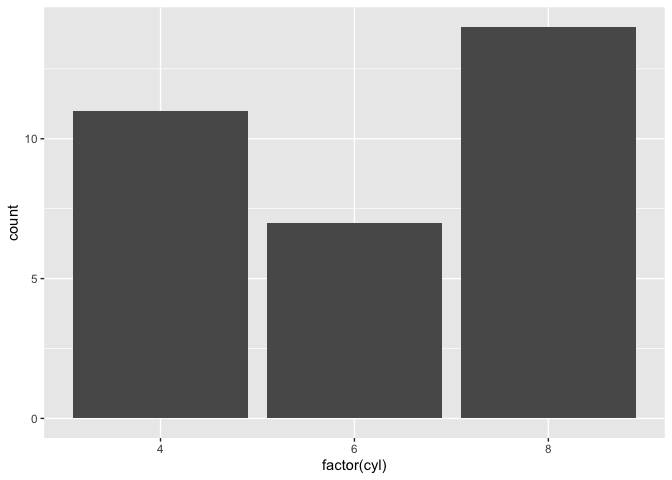

# This is my first Markdown file
## This is my first Markdown file
### This is my first Markdown file
#### This is my first Markdown file

```r
4*2
```

```
## [1] 8
```

## This is my [email](mailto:bacperez@ucdavis.edu)
## This is [Google](https://www.google.com/)

# Practice
## 1.Arithmetic Capabilities

```r
11+3
```

```
## [1] 14
```

```r
21-13
```

```
## [1] 8
```

```r
21/3
```

```
## [1] 7
```

```r
11*13
```

```
## [1] 143
```


## 2.Title

text
*italics*
~subscript~


## 3.Code Chunk

```r
#install.packages("tidyverse")
library("tidyverse")
```

```
## ── Attaching packages ─────────────────────────────────────── tidyverse 1.3.0 ──
```

```
## ✓ ggplot2 3.3.3     ✓ purrr   0.3.4
## ✓ tibble  3.0.4     ✓ dplyr   1.0.2
## ✓ tidyr   1.1.2     ✓ stringr 1.4.0
## ✓ readr   1.4.0     ✓ forcats 0.5.0
```

```
## ── Conflicts ────────────────────────────────────────── tidyverse_conflicts() ──
## x dplyr::filter() masks stats::filter()
## x dplyr::lag()    masks stats::lag()
```

```r
ggplot(mtcars, aes(x = factor(cyl))) +
    geom_bar()
```

<!-- -->


## 4.Knitting to html


## 5.Commit and Push to GitHub Repository

