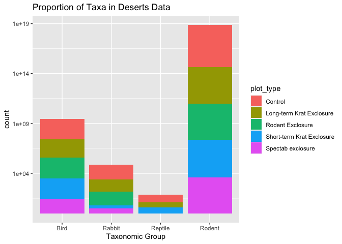
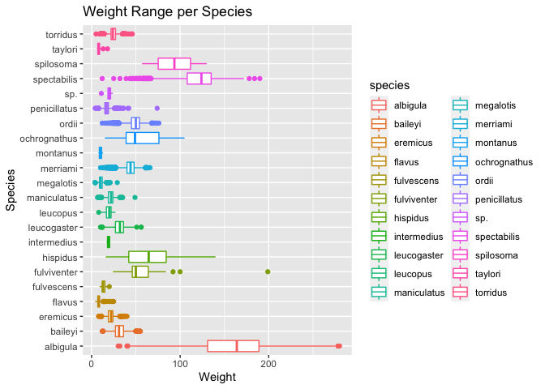
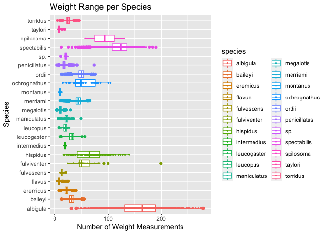
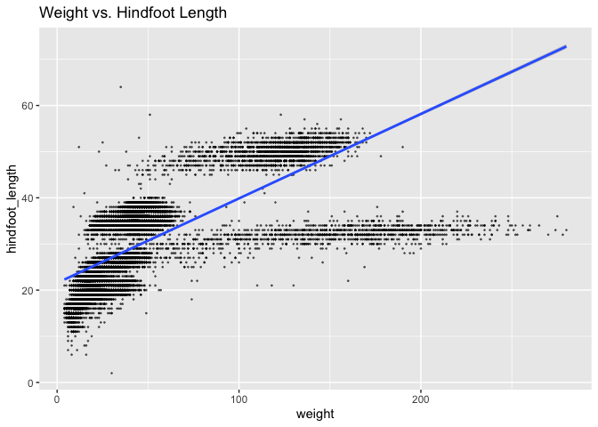

## Instructions
Answer the following questions and complete the exercises in RMarkdown. Please embed all of your code and push your final work to your repository. Your final lab report should be organized, clean, and run free from errors. Remember, you must remove the `#` for the included code chunks to run. Be sure to add your name to the author header above. For any included plots, make sure they are clearly labeled. You are free to use any plot type that you feel best communicates the results of your analysis.  

Make sure to use the formatting conventions of RMarkdown to make your report neat and clean!  

## Load the libraries

```r
library(tidyverse)
library(janitor)
library(here)
library(naniar)
```

## Desert Ecology
For this assignment, we are going to use a modified data set on [desert ecology](http://esapubs.org/archive/ecol/E090/118/). The data are from: S. K. Morgan Ernest, Thomas J. Valone, and James H. Brown. 2009. Long-term monitoring and experimental manipulation of a Chihuahuan Desert ecosystem near Portal, Arizona, USA. Ecology 90:1708.

```r
deserts <- read_csv(here("lab10", "data", "surveys_complete.csv"))
```

```
## 
## ── Column specification ────────────────────────────────────────────────────────
## cols(
##   record_id = col_double(),
##   month = col_double(),
##   day = col_double(),
##   year = col_double(),
##   plot_id = col_double(),
##   species_id = col_character(),
##   sex = col_character(),
##   hindfoot_length = col_double(),
##   weight = col_double(),
##   genus = col_character(),
##   species = col_character(),
##   taxa = col_character(),
##   plot_type = col_character()
## )
```

1. Use the function(s) of your choice to get an idea of its structure, including how NA's are treated. Are the data tidy?  

```r
glimpse(deserts)
```

```
## Rows: 34,786
## Columns: 13
## $ record_id       <dbl> 1, 2, 3, 4, 5, 6, 7, 8, 9, 10, 11, 12, 13, 14, 15, 16…
## $ month           <dbl> 7, 7, 7, 7, 7, 7, 7, 7, 7, 7, 7, 7, 7, 7, 7, 7, 7, 7,…
## $ day             <dbl> 16, 16, 16, 16, 16, 16, 16, 16, 16, 16, 16, 16, 16, 1…
## $ year            <dbl> 1977, 1977, 1977, 1977, 1977, 1977, 1977, 1977, 1977,…
## $ plot_id         <dbl> 2, 3, 2, 7, 3, 1, 2, 1, 1, 6, 5, 7, 3, 8, 6, 4, 3, 2,…
## $ species_id      <chr> "NL", "NL", "DM", "DM", "DM", "PF", "PE", "DM", "DM",…
## $ sex             <chr> "M", "M", "F", "M", "M", "M", "F", "M", "F", "F", "F"…
## $ hindfoot_length <dbl> 32, 33, 37, 36, 35, 14, NA, 37, 34, 20, 53, 38, 35, N…
## $ weight          <dbl> NA, NA, NA, NA, NA, NA, NA, NA, NA, NA, NA, NA, NA, N…
## $ genus           <chr> "Neotoma", "Neotoma", "Dipodomys", "Dipodomys", "Dipo…
## $ species         <chr> "albigula", "albigula", "merriami", "merriami", "merr…
## $ taxa            <chr> "Rodent", "Rodent", "Rodent", "Rodent", "Rodent", "Ro…
## $ plot_type       <chr> "Control", "Long-term Krat Exclosure", "Control", "Ro…
```

```r
naniar::miss_var_summary(deserts)
```

```
## # A tibble: 13 x 3
##    variable        n_miss pct_miss
##    <chr>            <int>    <dbl>
##  1 hindfoot_length   3348     9.62
##  2 weight            2503     7.20
##  3 sex               1748     5.03
##  4 record_id            0     0   
##  5 month                0     0   
##  6 day                  0     0   
##  7 year                 0     0   
##  8 plot_id              0     0   
##  9 species_id           0     0   
## 10 genus                0     0   
## 11 species              0     0   
## 12 taxa                 0     0   
## 13 plot_type            0     0
```
#Data doesn't seem tidy.

2. How many genera and species are represented in the data? What are the total number of observations? Which species is most/ least frequently sampled in the study?

```r
deserts %>% 
  summarise(genus_n = n_distinct(genus),
            species_n = n_distinct(species),
            observations_n = n())
```

```
## # A tibble: 1 x 3
##   genus_n species_n observations_n
##     <int>     <int>          <int>
## 1      26        40          34786
```

```r
deserts %>% 
  group_by(genus, species) %>% 
  summarise(observations_n = n()) %>% 
  arrange(desc(observations_n))
```

```
## `summarise()` has grouped output by 'genus'. You can override using the `.groups` argument.
```

```
## # A tibble: 48 x 3
## # Groups:   genus [26]
##    genus           species      observations_n
##    <chr>           <chr>                 <int>
##  1 Dipodomys       merriami              10596
##  2 Chaetodipus     penicillatus           3123
##  3 Dipodomys       ordii                  3027
##  4 Chaetodipus     baileyi                2891
##  5 Reithrodontomys megalotis              2609
##  6 Dipodomys       spectabilis            2504
##  7 Onychomys       torridus               2249
##  8 Perognathus     flavus                 1597
##  9 Peromyscus      eremicus               1299
## 10 Neotoma         albigula               1252
## # … with 38 more rows
```
#The most frequently sampled species was the (Dipodomys) Merriami and the least frequently sampled species were 6 species that were all sampled once. (Cnemidophorus) Tigris, (Cnemidophorus) Uniparens, (Crotalus) Scutalatus, (Crotalus) Viridis, (Sceloporus) Clarki, (Spermophilus) Tereticaudus.

3. What is the proportion of taxa included in this study? Show a table and plot that reflects this count.

```r
deserts %>% 
  count(taxa, sort=T)
```

```
## # A tibble: 4 x 2
##   taxa        n
##   <chr>   <int>
## 1 Rodent  34247
## 2 Bird      450
## 3 Rabbit     75
## 4 Reptile    14
```

```r
deserts %>% 
  ggplot(aes(x = taxa)) + geom_bar() + scale_y_log10()+
  labs(title = "Proportion of Taxa in Deserts Data",
       x = "Taxonomic Group")
```

<!-- -->

4. For the taxa included in the study, use the fill option to show the proportion of individuals sampled by `plot_type.`

```r
deserts %>% 
  ggplot(aes(x = taxa, fill = plot_type)) + geom_bar() + scale_y_log10() +
  labs(title = "Proportion of Taxa in Deserts Data",
       x = "Taxonomic Group",
       fill = "plot_type")
```

<!-- -->

5. What is the range of weight for each species included in the study? Remove any observations of weight that are NA so they do not show up in the plot.

```r
deserts %>% 
  group_by(species) %>% 
  filter(weight!="NA") %>% 
  ggplot(aes(x=species, y=weight, color = species)) +
  geom_boxplot(na.rm=T) + coord_flip()+
  labs(title="Weight Range per Species", x="Species", y = "Weight")
```

<!-- -->

6. Add another layer to your answer from #4 using `geom_point` to get an idea of how many measurements were taken for each species.

```r
deserts%>%
  group_by(species)%>%
  filter(weight!="NA")%>%
  ggplot(aes(x=species,y=weight, color=species))+
  geom_boxplot(na.rm=T)+ coord_flip()+
  geom_point(size=.5)+
  labs(title = "Weight Range per Species",
       x="Species",
       y="Number of Weight Measurements")
```

<!-- -->

7. [Dipodomys merriami](https://en.wikipedia.org/wiki/Merriam's_kangaroo_rat) is the most frequently sampled animal in the study. How have the number of observations of this species changed over the years included in the study?

```r
deserts %>%
  filter(genus=="Dipodomys", species=="merriami") %>%
  count(genus, species, year) %>%
  ggplot(aes(x=year, y=n))+geom_point()+
  labs(title="Count of Dipodomys merriami Over the Years", x="Year", y="n")+geom_smooth(method="lm", na.rm=T)
```

```
## `geom_smooth()` using formula 'y ~ x'
```

<!-- -->

8. What is the relationship between `weight` and `hindfoot` length? Consider whether or not over plotting is an issue.

```r
deserts %>% 
  ggplot(aes(x=weight, y=hindfoot_length))+geom_point(size=0.25,alpha=0.5,na.rm=T)+
  labs(title = "Weight vs. Hindfoot Length")+geom_smooth(method="lm", na.rm=T)
```

```
## `geom_smooth()` using formula 'y ~ x'
```

<!-- -->
#Overplotting can cause an issue when trying to distinguish data points from such a high sample liike presented here.

9. Which two species have, on average, the highest weight? Once you have identified them, make a new column that is a ratio of `weight` to `hindfoot_length`. Make a plot that shows the range of this new ratio and fill by sex.

```r
deserts %>% 
  filter(weight!="NA") %>% 
  group_by(species) %>% 
  summarize(mean_weight=mean(weight, na.rm=T)) %>% 
  arrange(desc(mean_weight))
```

```
## # A tibble: 22 x 2
##    species      mean_weight
##    <chr>              <dbl>
##  1 albigula           159. 
##  2 spectabilis        120. 
##  3 spilosoma           93.5
##  4 hispidus            65.6
##  5 fulviventer         58.9
##  6 ochrognathus        55.4
##  7 ordii               48.9
##  8 merriami            43.2
##  9 baileyi             31.7
## 10 leucogaster         31.6
## # … with 12 more rows
```

```r
deserts %>%
  filter(species=="albigula" | species=="spectabilis") %>%
  mutate(wt_hfl_ratio=weight/hindfoot_length)
```

```
## # A tibble: 3,756 x 14
##    record_id month   day  year plot_id species_id sex   hindfoot_length weight
##        <dbl> <dbl> <dbl> <dbl>   <dbl> <chr>      <chr>           <dbl>  <dbl>
##  1         1     7    16  1977       2 NL         M                  32     NA
##  2         2     7    16  1977       3 NL         M                  33     NA
##  3        11     7    16  1977       5 DS         F                  53     NA
##  4        17     7    16  1977       3 DS         F                  48     NA
##  5        20     7    17  1977      11 DS         F                  48     NA
##  6        22     7    17  1977      15 NL         F                  31     NA
##  7        30     7    17  1977      10 DS         F                  52     NA
##  8        38     7    17  1977      17 NL         M                  33     NA
##  9        42     7    18  1977      18 DS         F                  46     NA
## 10        58     7    18  1977      12 DS         M                  45     NA
## # … with 3,746 more rows, and 5 more variables: genus <chr>, species <chr>,
## #   taxa <chr>, plot_type <chr>, wt_hfl_ratio <dbl>
```

```r
deserts %>%
  filter(sex!="NA", weight!="NA", hindfoot_length!="NA") %>%
  filter(species=="albigula" | species=="spectabilis") %>%
  mutate(wt_hfl_ratio=weight/hindfoot_length) %>%
  ggplot(aes(x=species, y=wt_hfl_ratio, fill=sex))+geom_boxplot(nar.rm=T)+
  labs(title="Sex vs. Weight/Hindfoot Length Ration for albigula and spectabilis", x="Species", y="Weight/Hindfoot Length Ratio")
```

```
## Warning: Ignoring unknown parameters: nar.rm
```

<!-- -->

10. Make one plot of your choice! Make sure to include at least two of the aesthetics options you have learned.

```r
deserts %>%
  filter(sex!="NA") %>%
  ggplot(aes(x=species, fill=sex))+
  geom_bar(position="dodge")+
  coord_flip()+
  labs(title = "Sex Proportion Per Species",
       x = "Species",
       y = "n",
       fill = "Sex")
```

<!-- -->

## Push your final code to GitHub!
Please be sure that you check the `keep md` file in the knit preferences. 
