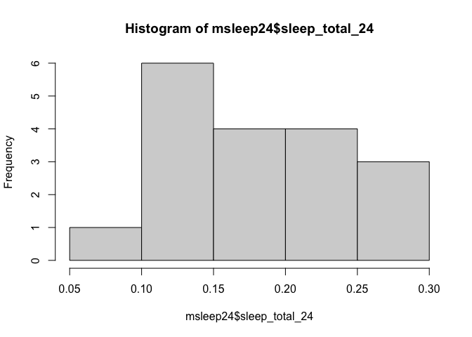

## Learning Goals
*At the end of this exercise, you will be able to:*    
1. Use a combination of `select()`, `filter()`, and `mutate()` to transform data frames.  
2. Use the `skimr` package to produce summaries of data.  
3. Produce clean summaries of data using `summarize()`.  
4. Use `group_by()` in combination with `summarize()` to produce grouped summaries of data.  

## Review
At this point, you should be comfortable using the functions of `dplyr`. If you need extra help, please [email me](mailto: jmledford@ucdavis.edu).  

## Package updates
In order to use some of the new function in the second part of lab today, you need to update your installed R packages. Please navigate to `Tools` >`Check for Package Updates...`. Follow the directions to update the packages.  

## Load the tidyverse and janitor

```r
library("tidyverse")
library("janitor")
```

## Install `skimr`

```r
#install.packages("skimr")
library("skimr")
```

## Load the data
For this lab, we will use the built-in data on mammal sleep patterns. From: _V. M. Savage and G. B. West. A quantitative, theoretical framework for understanding mammalian sleep. Proceedings of the National Academy of Sciences, 104 (3):1051-1056, 2007_.

```r
?msleep
names(msleep)
```

```
##  [1] "name"         "genus"        "vore"         "order"        "conservation"
##  [6] "sleep_total"  "sleep_rem"    "sleep_cycle"  "awake"        "brainwt"     
## [11] "bodywt"
```

We will also use the awesome [palmerpenguins](https://allisonhorst.github.io/palmerpenguins/articles/intro.html) data in the second part of lab so let's install it now.

```r
#install.packages("devtools")
```


```r
remotes::install_github("allisonhorst/palmerpenguins")
```

```
## Skipping install of 'palmerpenguins' from a github remote, the SHA1 (69530276) has not changed since last install.
##   Use `force = TRUE` to force installation
```

## dplyr Practice
1. Let's do a bit more practice to make sure that we understand `select()`, `filter()`, and `mutate()`. Start by building a new data frame `msleep24` from the `msleep` data that: contains the `name` and `vore` variables along with a new column called `sleep_total_24` which is the amount of time a species sleeps expressed as a proportion of a 24-hour day. Remove any rows with NA's and restrict the `sleep_total_24` values to less than 0.3. Arrange the output in descending order.  

```r
names(msleep)
```

```
##  [1] "name"         "genus"        "vore"         "order"        "conservation"
##  [6] "sleep_total"  "sleep_rem"    "sleep_cycle"  "awake"        "brainwt"     
## [11] "bodywt"
```


```r
msleep24<-msleep %>% 
  mutate(sleep_total_24 = sleep_total/24) %>% 
  select (name, vore, sleep_total_24) %>% 
  filter(!is.na(vore)) %>% 
  filter(sleep_total_24<0.3) %>% 
  arrange(desc(sleep_total_24))
msleep24
```

```
## # A tibble: 18 x 3
##    name                 vore  sleep_total_24
##    <chr>                <chr>          <dbl>
##  1 Gray hyrax           herbi         0.262 
##  2 Genet                carni         0.262 
##  3 Gray seal            carni         0.258 
##  4 Common porpoise      carni         0.233 
##  5 Goat                 herbi         0.221 
##  6 Tree hyrax           herbi         0.221 
##  7 Bottle-nosed dolphin carni         0.217 
##  8 Brazilian tapir      herbi         0.183 
##  9 Cow                  herbi         0.167 
## 10 Asian elephant       herbi         0.162 
## 11 Sheep                herbi         0.158 
## 12 Caspian seal         carni         0.146 
## 13 African elephant     herbi         0.137 
## 14 Donkey               herbi         0.129 
## 15 Roe deer             herbi         0.125 
## 16 Horse                herbi         0.121 
## 17 Pilot whale          carni         0.112 
## 18 Giraffe              herbi         0.0792
```

Did `dplyr` do what we expected? How do we check our output? Remember, just because your code runs it doesn't mean that it did what you intended.

```r
summary(msleep24)
```

```
##      name               vore           sleep_total_24   
##  Length:18          Length:18          Min.   :0.07917  
##  Class :character   Class :character   1st Qu.:0.13125  
##  Mode  :character   Mode  :character   Median :0.16458  
##                                        Mean   :0.17755  
##                                        3rd Qu.:0.22083  
##                                        Max.   :0.26250
```

Try out the new function `skim()` as part of the `skimr` package.

```r
skim(msleep24)
```


Table: Data summary

|                         |         |
|:------------------------|:--------|
|Name                     |msleep24 |
|Number of rows           |18       |
|Number of columns        |3        |
|_______________________  |         |
|Column type frequency:   |         |
|character                |2        |
|numeric                  |1        |
|________________________ |         |
|Group variables          |None     |


**Variable type: character**

|skim_variable | n_missing| complete_rate| min| max| empty| n_unique| whitespace|
|:-------------|---------:|-------------:|---:|---:|-----:|--------:|----------:|
|name          |         0|             1|   3|  20|     0|       18|          0|
|vore          |         0|             1|   5|   5|     0|        2|          0|


**Variable type: numeric**

|skim_variable  | n_missing| complete_rate| mean|   sd|   p0|  p25|  p50|  p75| p100|hist  |
|:--------------|---------:|-------------:|----:|----:|----:|----:|----:|----:|----:|:-----|
|sleep_total_24 |         0|             1| 0.18| 0.06| 0.08| 0.13| 0.16| 0.22| 0.26|▃▇▆▅▆ |

Histograms are also a quick way to check the output.

```r
hist(msleep24$sleep_total_24)
```

<!-- -->

Don't forget we can also use `tabyl()` across one or many variables.

```r
tabyl(msleep24$sleep_total_24)
```

```
##  msleep24$sleep_total_24 n    percent
##               0.07916667 1 0.05555556
##               0.11250000 1 0.05555556
##               0.12083333 1 0.05555556
##               0.12500000 1 0.05555556
##               0.12916667 1 0.05555556
##               0.13750000 1 0.05555556
##               0.14583333 1 0.05555556
##               0.15833333 1 0.05555556
##               0.16250000 1 0.05555556
##               0.16666667 1 0.05555556
##               0.18333333 1 0.05555556
##               0.21666667 1 0.05555556
##               0.22083333 2 0.11111111
##               0.23333333 1 0.05555556
##               0.25833333 1 0.05555556
##               0.26250000 2 0.11111111
```

```r
msleep24 %>% 
  tabyl(vore) %>% 
  adorn_pct_formatting(digits = 1)
```

```
##   vore  n percent
##  carni  6   33.3%
##  herbi 12   66.7%
```

## Practice
1. Which taxonomic orders have species that belong to more than one class of `vore`?

```r
names(msleep)
```

```
##  [1] "name"         "genus"        "vore"         "order"        "conservation"
##  [6] "sleep_total"  "sleep_rem"    "sleep_cycle"  "awake"        "brainwt"     
## [11] "bodywt"
```

```r
msleep %>% 
  filter(!is.na(vore)) %>% 
  tabyl(order,vore)
```

```
##            order carni herbi insecti omni
##     Afrosoricida     0     0       0    1
##     Artiodactyla     0     5       0    1
##        Carnivora    12     0       0    0
##          Cetacea     3     0       0    0
##       Chiroptera     0     0       2    0
##        Cingulata     1     0       1    0
##  Didelphimorphia     1     0       0    1
##    Diprotodontia     0     1       0    0
##   Erinaceomorpha     0     0       0    1
##       Hyracoidea     0     2       0    0
##       Lagomorpha     0     1       0    0
##      Monotremata     0     0       1    0
##   Perissodactyla     0     3       0    0
##           Pilosa     0     1       0    0
##         Primates     1     1       0   10
##      Proboscidea     0     2       0    0
##         Rodentia     1    16       0    2
##       Scandentia     0     0       0    1
##     Soricomorpha     0     0       1    3
```

## `summarize()`
`summarize()` will produce summary statistics for a given variable in a data frame. For example, if you are asked to calculate the mean of `sleep_total` for large and small mammals you could do this using a combination of commands, but it isn't very efficient or clean. We can do better!  

```r
head(msleep)
```

```
## # A tibble: 6 x 11
##   name  genus vore  order conservation sleep_total sleep_rem sleep_cycle awake
##   <chr> <chr> <chr> <chr> <chr>              <dbl>     <dbl>       <dbl> <dbl>
## 1 Chee… Acin… carni Carn… lc                  12.1      NA        NA      11.9
## 2 Owl … Aotus omni  Prim… <NA>                17         1.8      NA       7  
## 3 Moun… Aplo… herbi Rode… nt                  14.4       2.4      NA       9.6
## 4 Grea… Blar… omni  Sori… lc                  14.9       2.3       0.133   9.1
## 5 Cow   Bos   herbi Arti… domesticated         4         0.7       0.667  20  
## 6 Thre… Brad… herbi Pilo… <NA>                14.4       2.2       0.767   9.6
## # … with 2 more variables: brainwt <dbl>, bodywt <dbl>
```

For example, if we define "large" as having a `bodywt` greater than 200 then we get the following:

```r
large <- 
  msleep %>% 
  select(name, genus, bodywt, sleep_total) %>% 
  filter(bodywt > 200) %>% 
  arrange(desc(bodywt))
large
```

```
## # A tibble: 7 x 4
##   name             genus         bodywt sleep_total
##   <chr>            <chr>          <dbl>       <dbl>
## 1 African elephant Loxodonta      6654          3.3
## 2 Asian elephant   Elephas        2547          3.9
## 3 Giraffe          Giraffa         900.         1.9
## 4 Pilot whale      Globicephalus   800          2.7
## 5 Cow              Bos             600          4  
## 6 Horse            Equus           521          2.9
## 7 Brazilian tapir  Tapirus         208.         4.4
```


```r
mean(large$sleep_total)
```

```
## [1] 3.3
```

We can accomplish the same task using the `summarize()` function to make things cleaner.

```r
msleep %>% 
  filter(bodywt > 200) %>%
  summarize(mean_sleep_lg = mean(sleep_total))
```

```
## # A tibble: 1 x 1
##   mean_sleep_lg
##           <dbl>
## 1           3.3
```

You can also combine functions to make useful summaries for multiple variables.

```r
msleep %>% 
    filter(bodywt > 200) %>% 
    summarize(mean_sleep_lg = mean(sleep_total), 
              min_sleep_lg = min(sleep_total),
              max_sleep_lg = max(sleep_total),
              total = n())
```

```
## # A tibble: 1 x 4
##   mean_sleep_lg min_sleep_lg max_sleep_lg total
##           <dbl>        <dbl>        <dbl> <int>
## 1           3.3          1.9          4.4     7
```

## Practice
1. What is the mean, min, and max `bodywt` for the taxonomic order Primates? Provide the total number of observations.

```r
msleep %>% 
  filter(order == "Primates") %>% 
  summarize(mean_bodywt_Primates=mean(bodywt),
            min_bodywt_Primates=min(bodywt),
            max_bodywt_Primates=max(bodywt),
            total = n())
```

```
## # A tibble: 1 x 4
##   mean_bodywt_Primates min_bodywt_Primates max_bodywt_Primates total
##                  <dbl>               <dbl>               <dbl> <int>
## 1                 13.9                 0.2                  62    12
```

`n_distinct()` is a very handy way of cleanly presenting the number of distinct observations. Here we show the number of distinct genera over 100 in body weight.

```r
msleep %>% 
  filter(bodywt > 100) %>% 
  summarise(n_genera=n_distinct(genus))
```

```
## # A tibble: 1 x 1
##   n_genera
##      <int>
## 1        9
```

There are many other useful summary statistics, depending on your needs: sd(), min(), max(), median(), sum(), n() (returns the length of a column), first() (returns first value in a column), last() (returns last value in a column) and n_distinct() (number of distinct values in a column).

## Practice
1. How many genera are represented in the msleep data frame?

```r
names(msleep)
```

```
##  [1] "name"         "genus"        "vore"         "order"        "conservation"
##  [6] "sleep_total"  "sleep_rem"    "sleep_cycle"  "awake"        "brainwt"     
## [11] "bodywt"
```

```r
msleep %>% 
  tabyl(genus)
```

```
##          genus n    percent
##       Acinonyx 1 0.01204819
##          Aotus 1 0.01204819
##     Aplodontia 1 0.01204819
##        Blarina 1 0.01204819
##            Bos 1 0.01204819
##       Bradypus 1 0.01204819
##    Callorhinus 1 0.01204819
##        Calomys 1 0.01204819
##          Canis 1 0.01204819
##      Capreolus 1 0.01204819
##          Capri 1 0.01204819
##          Cavis 1 0.01204819
##  Cercopithecus 1 0.01204819
##     Chinchilla 1 0.01204819
##      Condylura 1 0.01204819
##     Cricetomys 1 0.01204819
##      Cryptotis 1 0.01204819
##        Dasypus 1 0.01204819
##    Dendrohyrax 1 0.01204819
##      Didelphis 1 0.01204819
##        Elephas 1 0.01204819
##      Eptesicus 1 0.01204819
##          Equus 2 0.02409639
##      Erinaceus 1 0.01204819
##   Erythrocebus 1 0.01204819
##       Eutamias 1 0.01204819
##          Felis 1 0.01204819
##         Galago 1 0.01204819
##        Genetta 1 0.01204819
##        Giraffa 1 0.01204819
##  Globicephalus 1 0.01204819
##   Haliochoerus 1 0.01204819
##    Heterohyrax 1 0.01204819
##           Homo 1 0.01204819
##          Lemur 1 0.01204819
##      Loxodonta 1 0.01204819
##     Lutreolina 1 0.01204819
##         Macaca 1 0.01204819
##       Meriones 1 0.01204819
##   Mesocricetus 1 0.01204819
##       Microtus 1 0.01204819
##            Mus 1 0.01204819
##         Myotis 1 0.01204819
##       Neofiber 1 0.01204819
##      Nyctibeus 1 0.01204819
##        Octodon 1 0.01204819
##      Onychomys 1 0.01204819
##    Oryctolagus 1 0.01204819
##           Ovis 1 0.01204819
##            Pan 1 0.01204819
##       Panthera 3 0.03614458
##          Papio 1 0.01204819
##    Paraechinus 1 0.01204819
##   Perodicticus 1 0.01204819
##     Peromyscus 1 0.01204819
##      Phalanger 1 0.01204819
##          Phoca 1 0.01204819
##       Phocoena 1 0.01204819
##       Potorous 1 0.01204819
##     Priodontes 1 0.01204819
##       Procavia 1 0.01204819
##         Rattus 1 0.01204819
##      Rhabdomys 1 0.01204819
##        Saimiri 1 0.01204819
##       Scalopus 1 0.01204819
##       Sigmodon 1 0.01204819
##         Spalax 1 0.01204819
##   Spermophilus 3 0.03614458
##         Suncus 1 0.01204819
##            Sus 1 0.01204819
##   Tachyglossus 1 0.01204819
##         Tamias 1 0.01204819
##        Tapirus 1 0.01204819
##         Tenrec 1 0.01204819
##         Tupaia 1 0.01204819
##       Tursiops 1 0.01204819
##         Vulpes 2 0.02409639
```

2. What are the min, max, and mean `sleep_total` for all of the mammals? Be sure to include the total n.

```r
msleep %>%
  group_by(name) %>% 
  summarize(min_sleep_total=min(sleep_total, na.rm = TRUE),
            max_sleep_total=max(sleep_total, na.rm = TRUE),
            mean_sleep_total=mean(sleep_total, na.rm = TRUE),
            total=n())
```

```
## # A tibble: 83 x 5
##    name                   min_sleep_total max_sleep_total mean_sleep_total total
##  * <chr>                            <dbl>           <dbl>            <dbl> <int>
##  1 African elephant                   3.3             3.3              3.3     1
##  2 African giant pouched…             8.3             8.3              8.3     1
##  3 African striped mouse              8.7             8.7              8.7     1
##  4 Arctic fox                        12.5            12.5             12.5     1
##  5 Arctic ground squirrel            16.6            16.6             16.6     1
##  6 Asian elephant                     3.9             3.9              3.9     1
##  7 Baboon                             9.4             9.4              9.4     1
##  8 Big brown bat                     19.7            19.7             19.7     1
##  9 Bottle-nosed dolphin               5.2             5.2              5.2     1
## 10 Brazilian tapir                    4.4             4.4              4.4     1
## # … with 73 more rows
```

## `group_by()`
The `summarize()` function is most useful when used in conjunction with `group_by()`. Although producing a summary of body weight for all of the mammals in the data set is helpful, what if we were interested in body weight by feeding ecology?

```r
msleep %>%
  group_by(vore) %>% #we are grouping by feeding ecology
  summarize(min_bodywt = min(bodywt),
            max_bodywt = max(bodywt),
            mean_bodywt = mean(bodywt),
            total=n())
```

```
## # A tibble: 5 x 5
##   vore    min_bodywt max_bodywt mean_bodywt total
## * <chr>        <dbl>      <dbl>       <dbl> <int>
## 1 carni        0.028      800        90.8      19
## 2 herbi        0.022     6654       367.       32
## 3 insecti      0.01        60        12.9       5
## 4 omni         0.005       86.2      12.7      20
## 5 <NA>         0.021        3.6       0.858     7
```

## Practice
1. Calculate mean brain weight by taxonomic order in the msleep data.

```r
names(msleep)
```

```
##  [1] "name"         "genus"        "vore"         "order"        "conservation"
##  [6] "sleep_total"  "sleep_rem"    "sleep_cycle"  "awake"        "brainwt"     
## [11] "bodywt"
```

```r
msleep %>% 
  group_by(order) %>% 
  summarize(mean_brainwt=mean(brainwt)
            ,total=n())
```

```
## # A tibble: 19 x 3
##    order           mean_brainwt total
##  * <chr>                  <dbl> <int>
##  1 Afrosoricida        0.0026       1
##  2 Artiodactyla       NA            6
##  3 Carnivora          NA           12
##  4 Cetacea            NA            3
##  5 Chiroptera          0.000275     2
##  6 Cingulata           0.0459       2
##  7 Didelphimorphia    NA            2
##  8 Diprotodontia      NA            2
##  9 Erinaceomorpha      0.00295      2
## 10 Hyracoidea          0.0152       3
## 11 Lagomorpha          0.0121       1
## 12 Monotremata         0.025        1
## 13 Perissodactyla      0.414        3
## 14 Pilosa             NA            1
## 15 Primates           NA           12
## 16 Proboscidea         5.16         2
## 17 Rodentia           NA           22
## 18 Scandentia          0.0025       1
## 19 Soricomorpha        0.000592     5
```


2. What does `NA` mean? How are NA's being treated by the summarize function?
#NA's mean there was no conclusive data obtained data for that sample. NA's are being counted by the summarize function (even if just 1) and therefore counting the mean as NA

3. Try running the code again, but this time add `na.rm=TRUE`. What is the problem with Cetacea? Compare this to Carnivora. 

```r
msleep %>% 
  group_by(order) %>% 
  summarize(mean_brainwt=mean(brainwt, na.rm = TRUE),
            total=n()) %>% 
  arrange(desc(mean_brainwt))
```

```
## # A tibble: 19 x 3
##    order           mean_brainwt total
##    <chr>                  <dbl> <int>
##  1 Proboscidea         5.16         2
##  2 Perissodactyla      0.414        3
##  3 Primates            0.254       12
##  4 Artiodactyla        0.198        6
##  5 Carnivora           0.0986      12
##  6 Cingulata           0.0459       2
##  7 Monotremata         0.025        1
##  8 Hyracoidea          0.0152       3
##  9 Lagomorpha          0.0121       1
## 10 Diprotodontia       0.0114       2
## 11 Didelphimorphia     0.0063       2
## 12 Rodentia            0.00357     22
## 13 Erinaceomorpha      0.00295      2
## 14 Afrosoricida        0.0026       1
## 15 Scandentia          0.0025       1
## 16 Soricomorpha        0.000592     5
## 17 Chiroptera          0.000275     2
## 18 Cetacea           NaN            3
## 19 Pilosa            NaN            1
```
#It could be that Cetacea had all 3 counts be NA and so "NaN" stands for the true value for that order. In comparison to Carnivora, Carnivora has a higher n sample and a mean_brainwt of "0.09857143" meaning all samples had a conclusive obtained data.

## That's it! Take a break and I will see you on Zoom!  

-->[Home](https://jmledford3115.github.io/datascibiol/)  
