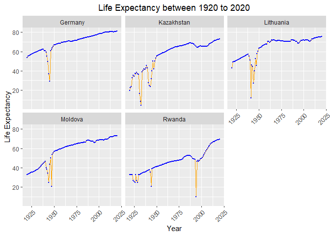
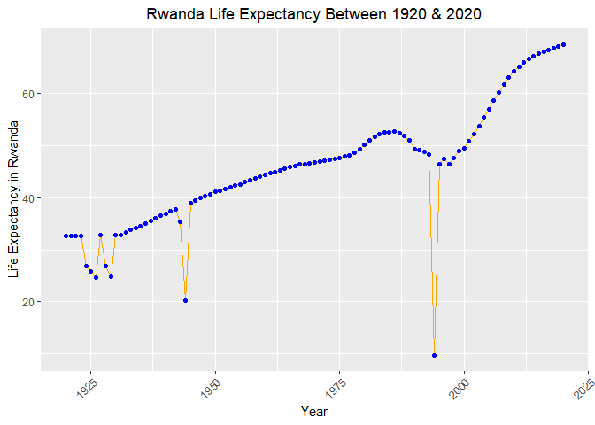
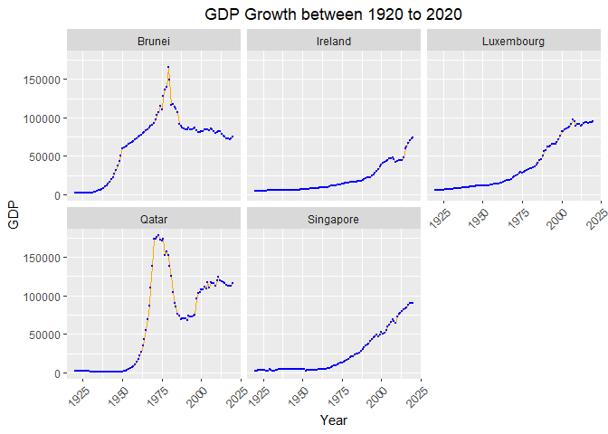

## Instructions
Answer the following questions and complete the exercises in RMarkdown. Please embed all of your code and push your final work to your repository. Your code should be organized, clean, and run free from errors. Be sure to **add your name** to the author header above. You may use any resources to answer these questions (including each other), but you may not post questions to Open Stacks or external help sites. There are 10 total questions.  

Make sure to use the formatting conventions of RMarkdown to make your report neat and clean! Your plots should use consistent aesthetics throughout. Feel free to be creative- there are many possible solutions to these questions!  

This exam is due by **12:00p on Tuesday, February 23**.  

## Load the libraries

```r
library(tidyverse)
```

```
## ── Attaching packages ─────────────────────────────────────── tidyverse 1.3.0 ──
```

```
## ✓ ggplot2 3.3.3     ✓ purrr   0.3.4
## ✓ tibble  3.0.5     ✓ dplyr   1.0.3
## ✓ tidyr   1.1.2     ✓ stringr 1.4.0
## ✓ readr   1.4.0     ✓ forcats 0.5.1
```

```
## ── Conflicts ────────────────────────────────────────── tidyverse_conflicts() ──
## x dplyr::filter() masks stats::filter()
## x dplyr::lag()    masks stats::lag()
```

```r
library(janitor)
```

```
## 
## Attaching package: 'janitor'
```

```
## The following objects are masked from 'package:stats':
## 
##     chisq.test, fisher.test
```

```r
library(here)
```

```
## here() starts at /Users/Zuzu/Desktop/BIS15W2021_bcoradoperez
```

```r
options(scipen=999) #disables scientific notation when printing
```

## Gapminder
For this assignment, we are going to use data from  [gapminder](https://www.gapminder.org/). Gapminder includes information about economics, population, social issues, and life expectancy from countries all over the world. We will use three data sets, so please load all three.  

One thing to note is that the data include years beyond 2021. These are projections based on modeling done by the gapminder organization. Start by importing the data.

```r
population <- readr::read_csv("data/population_total.csv")
```

```
## 
## ── Column specification ────────────────────────────────────────────────────────
## cols(
##   .default = col_double(),
##   country = col_character()
## )
## ℹ Use `spec()` for the full column specifications.
```

```r
population
```

```
## # A tibble: 195 x 302
##    country `1800` `1801` `1802` `1803` `1804` `1805` `1806` `1807` `1808` `1809`
##    <chr>    <dbl>  <dbl>  <dbl>  <dbl>  <dbl>  <dbl>  <dbl>  <dbl>  <dbl>  <dbl>
##  1 Afghan… 3.28e6 3.28e6 3.28e6 3.28e6 3.28e6 3.28e6 3.28e6 3.28e6 3.28e6 3.28e6
##  2 Albania 4.00e5 4.02e5 4.04e5 4.05e5 4.07e5 4.09e5 4.11e5 4.13e5 4.14e5 4.16e5
##  3 Algeria 2.50e6 2.51e6 2.52e6 2.53e6 2.54e6 2.55e6 2.56e6 2.56e6 2.57e6 2.58e6
##  4 Andorra 2.65e3 2.65e3 2.65e3 2.65e3 2.65e3 2.65e3 2.65e3 2.65e3 2.65e3 2.65e3
##  5 Angola  1.57e6 1.57e6 1.57e6 1.57e6 1.57e6 1.57e6 1.57e6 1.57e6 1.57e6 1.57e6
##  6 Antigu… 3.70e4 3.70e4 3.70e4 3.70e4 3.70e4 3.70e4 3.70e4 3.70e4 3.70e4 3.70e4
##  7 Argent… 5.34e5 5.20e5 5.06e5 4.92e5 4.79e5 4.66e5 4.53e5 4.41e5 4.29e5 4.17e5
##  8 Armenia 4.13e5 4.13e5 4.13e5 4.13e5 4.13e5 4.13e5 4.13e5 4.13e5 4.13e5 4.13e5
##  9 Austra… 2.00e5 2.05e5 2.11e5 2.16e5 2.22e5 2.27e5 2.33e5 2.39e5 2.46e5 2.52e5
## 10 Austria 3.00e6 3.02e6 3.04e6 3.05e6 3.07e6 3.09e6 3.11e6 3.12e6 3.14e6 3.16e6
## # … with 185 more rows, and 291 more variables: `1810` <dbl>, `1811` <dbl>,
## #   `1812` <dbl>, `1813` <dbl>, `1814` <dbl>, `1815` <dbl>, `1816` <dbl>,
## #   `1817` <dbl>, `1818` <dbl>, `1819` <dbl>, `1820` <dbl>, `1821` <dbl>,
## #   `1822` <dbl>, `1823` <dbl>, `1824` <dbl>, `1825` <dbl>, `1826` <dbl>,
## #   `1827` <dbl>, `1828` <dbl>, `1829` <dbl>, `1830` <dbl>, `1831` <dbl>,
## #   `1832` <dbl>, `1833` <dbl>, `1834` <dbl>, `1835` <dbl>, `1836` <dbl>,
## #   `1837` <dbl>, `1838` <dbl>, `1839` <dbl>, `1840` <dbl>, `1841` <dbl>,
## #   `1842` <dbl>, `1843` <dbl>, `1844` <dbl>, `1845` <dbl>, `1846` <dbl>,
## #   `1847` <dbl>, `1848` <dbl>, `1849` <dbl>, `1850` <dbl>, `1851` <dbl>,
## #   `1852` <dbl>, `1853` <dbl>, `1854` <dbl>, `1855` <dbl>, `1856` <dbl>,
## #   `1857` <dbl>, `1858` <dbl>, `1859` <dbl>, `1860` <dbl>, `1861` <dbl>,
## #   `1862` <dbl>, `1863` <dbl>, `1864` <dbl>, `1865` <dbl>, `1866` <dbl>,
## #   `1867` <dbl>, `1868` <dbl>, `1869` <dbl>, `1870` <dbl>, `1871` <dbl>,
## #   `1872` <dbl>, `1873` <dbl>, `1874` <dbl>, `1875` <dbl>, `1876` <dbl>,
## #   `1877` <dbl>, `1878` <dbl>, `1879` <dbl>, `1880` <dbl>, `1881` <dbl>,
## #   `1882` <dbl>, `1883` <dbl>, `1884` <dbl>, `1885` <dbl>, `1886` <dbl>,
## #   `1887` <dbl>, `1888` <dbl>, `1889` <dbl>, `1890` <dbl>, `1891` <dbl>,
## #   `1892` <dbl>, `1893` <dbl>, `1894` <dbl>, `1895` <dbl>, `1896` <dbl>,
## #   `1897` <dbl>, `1898` <dbl>, `1899` <dbl>, `1900` <dbl>, `1901` <dbl>,
## #   `1902` <dbl>, `1903` <dbl>, `1904` <dbl>, `1905` <dbl>, `1906` <dbl>,
## #   `1907` <dbl>, `1908` <dbl>, `1909` <dbl>, …
```


```r
income <- readr::read_csv("data/income_per_person_gdppercapita_ppp_inflation_adjusted.csv")
```

```
## 
## ── Column specification ────────────────────────────────────────────────────────
## cols(
##   .default = col_double(),
##   country = col_character()
## )
## ℹ Use `spec()` for the full column specifications.
```

```r
income
```

```
## # A tibble: 193 x 242
##    country `1800` `1801` `1802` `1803` `1804` `1805` `1806` `1807` `1808` `1809`
##    <chr>    <dbl>  <dbl>  <dbl>  <dbl>  <dbl>  <dbl>  <dbl>  <dbl>  <dbl>  <dbl>
##  1 Afghan…    603    603    603    603    603    603    603    603    603    603
##  2 Albania    667    667    667    667    667    668    668    668    668    668
##  3 Algeria    715    716    717    718    719    720    721    722    723    724
##  4 Andorra   1200   1200   1200   1200   1210   1210   1210   1210   1220   1220
##  5 Angola     618    620    623    626    628    631    634    637    640    642
##  6 Antigu…    757    757    757    757    757    757    757    758    758    758
##  7 Argent…   1640   1640   1650   1650   1660   1660   1670   1680   1680   1690
##  8 Armenia    514    514    514    514    514    514    514    514    514    514
##  9 Austra…    817    822    826    831    836    841    845    850    855    860
## 10 Austria   1850   1850   1860   1870   1880   1880   1890   1900   1910   1920
## # … with 183 more rows, and 231 more variables: `1810` <dbl>, `1811` <dbl>,
## #   `1812` <dbl>, `1813` <dbl>, `1814` <dbl>, `1815` <dbl>, `1816` <dbl>,
## #   `1817` <dbl>, `1818` <dbl>, `1819` <dbl>, `1820` <dbl>, `1821` <dbl>,
## #   `1822` <dbl>, `1823` <dbl>, `1824` <dbl>, `1825` <dbl>, `1826` <dbl>,
## #   `1827` <dbl>, `1828` <dbl>, `1829` <dbl>, `1830` <dbl>, `1831` <dbl>,
## #   `1832` <dbl>, `1833` <dbl>, `1834` <dbl>, `1835` <dbl>, `1836` <dbl>,
## #   `1837` <dbl>, `1838` <dbl>, `1839` <dbl>, `1840` <dbl>, `1841` <dbl>,
## #   `1842` <dbl>, `1843` <dbl>, `1844` <dbl>, `1845` <dbl>, `1846` <dbl>,
## #   `1847` <dbl>, `1848` <dbl>, `1849` <dbl>, `1850` <dbl>, `1851` <dbl>,
## #   `1852` <dbl>, `1853` <dbl>, `1854` <dbl>, `1855` <dbl>, `1856` <dbl>,
## #   `1857` <dbl>, `1858` <dbl>, `1859` <dbl>, `1860` <dbl>, `1861` <dbl>,
## #   `1862` <dbl>, `1863` <dbl>, `1864` <dbl>, `1865` <dbl>, `1866` <dbl>,
## #   `1867` <dbl>, `1868` <dbl>, `1869` <dbl>, `1870` <dbl>, `1871` <dbl>,
## #   `1872` <dbl>, `1873` <dbl>, `1874` <dbl>, `1875` <dbl>, `1876` <dbl>,
## #   `1877` <dbl>, `1878` <dbl>, `1879` <dbl>, `1880` <dbl>, `1881` <dbl>,
## #   `1882` <dbl>, `1883` <dbl>, `1884` <dbl>, `1885` <dbl>, `1886` <dbl>,
## #   `1887` <dbl>, `1888` <dbl>, `1889` <dbl>, `1890` <dbl>, `1891` <dbl>,
## #   `1892` <dbl>, `1893` <dbl>, `1894` <dbl>, `1895` <dbl>, `1896` <dbl>,
## #   `1897` <dbl>, `1898` <dbl>, `1899` <dbl>, `1900` <dbl>, `1901` <dbl>,
## #   `1902` <dbl>, `1903` <dbl>, `1904` <dbl>, `1905` <dbl>, `1906` <dbl>,
## #   `1907` <dbl>, `1908` <dbl>, `1909` <dbl>, …
```

```r
life_expectancy <- readr::read_csv("data/life_expectancy_years.csv")
```

```
## 
## ── Column specification ────────────────────────────────────────────────────────
## cols(
##   .default = col_double(),
##   country = col_character()
## )
## ℹ Use `spec()` for the full column specifications.
```

```r
life_expectancy
```

```
## # A tibble: 187 x 302
##    country `1800` `1801` `1802` `1803` `1804` `1805` `1806` `1807` `1808` `1809`
##    <chr>    <dbl>  <dbl>  <dbl>  <dbl>  <dbl>  <dbl>  <dbl>  <dbl>  <dbl>  <dbl>
##  1 Afghan…   28.2   28.2   28.2   28.2   28.2   28.2   28.1   28.1   28.1   28.1
##  2 Albania   35.4   35.4   35.4   35.4   35.4   35.4   35.4   35.4   35.4   35.4
##  3 Algeria   28.8   28.8   28.8   28.8   28.8   28.8   28.8   28.8   28.8   28.8
##  4 Andorra   NA     NA     NA     NA     NA     NA     NA     NA     NA     NA  
##  5 Angola    27     27     27     27     27     27     27     27     27     27  
##  6 Antigu…   33.5   33.5   33.5   33.5   33.5   33.5   33.5   33.5   33.5   33.5
##  7 Argent…   33.2   33.2   33.2   33.2   33.2   33.2   33.2   33.2   33.2   33.2
##  8 Armenia   34     34     34     34     34     34     34     34     34     34  
##  9 Austra…   34     34     34     34     34     34     34     34     34     34  
## 10 Austria   34.4   34.4   34.4   34.4   34.4   34.4   34.4   34.4   34.4   34.4
## # … with 177 more rows, and 291 more variables: `1810` <dbl>, `1811` <dbl>,
## #   `1812` <dbl>, `1813` <dbl>, `1814` <dbl>, `1815` <dbl>, `1816` <dbl>,
## #   `1817` <dbl>, `1818` <dbl>, `1819` <dbl>, `1820` <dbl>, `1821` <dbl>,
## #   `1822` <dbl>, `1823` <dbl>, `1824` <dbl>, `1825` <dbl>, `1826` <dbl>,
## #   `1827` <dbl>, `1828` <dbl>, `1829` <dbl>, `1830` <dbl>, `1831` <dbl>,
## #   `1832` <dbl>, `1833` <dbl>, `1834` <dbl>, `1835` <dbl>, `1836` <dbl>,
## #   `1837` <dbl>, `1838` <dbl>, `1839` <dbl>, `1840` <dbl>, `1841` <dbl>,
## #   `1842` <dbl>, `1843` <dbl>, `1844` <dbl>, `1845` <dbl>, `1846` <dbl>,
## #   `1847` <dbl>, `1848` <dbl>, `1849` <dbl>, `1850` <dbl>, `1851` <dbl>,
## #   `1852` <dbl>, `1853` <dbl>, `1854` <dbl>, `1855` <dbl>, `1856` <dbl>,
## #   `1857` <dbl>, `1858` <dbl>, `1859` <dbl>, `1860` <dbl>, `1861` <dbl>,
## #   `1862` <dbl>, `1863` <dbl>, `1864` <dbl>, `1865` <dbl>, `1866` <dbl>,
## #   `1867` <dbl>, `1868` <dbl>, `1869` <dbl>, `1870` <dbl>, `1871` <dbl>,
## #   `1872` <dbl>, `1873` <dbl>, `1874` <dbl>, `1875` <dbl>, `1876` <dbl>,
## #   `1877` <dbl>, `1878` <dbl>, `1879` <dbl>, `1880` <dbl>, `1881` <dbl>,
## #   `1882` <dbl>, `1883` <dbl>, `1884` <dbl>, `1885` <dbl>, `1886` <dbl>,
## #   `1887` <dbl>, `1888` <dbl>, `1889` <dbl>, `1890` <dbl>, `1891` <dbl>,
## #   `1892` <dbl>, `1893` <dbl>, `1894` <dbl>, `1895` <dbl>, `1896` <dbl>,
## #   `1897` <dbl>, `1898` <dbl>, `1899` <dbl>, `1900` <dbl>, `1901` <dbl>,
## #   `1902` <dbl>, `1903` <dbl>, `1904` <dbl>, `1905` <dbl>, `1906` <dbl>,
## #   `1907` <dbl>, `1908` <dbl>, `1909` <dbl>, …
```

1. (3 points) Once you have an idea of the structure of the data, please make each data set tidy and store them as new objects. You will need both the original and tidy data!

```r
population_v2<-janitor::clean_names(population)
population_v2
```

```
## # A tibble: 195 x 302
##    country  x1800  x1801  x1802  x1803  x1804  x1805  x1806  x1807  x1808  x1809
##    <chr>    <dbl>  <dbl>  <dbl>  <dbl>  <dbl>  <dbl>  <dbl>  <dbl>  <dbl>  <dbl>
##  1 Afghan… 3.28e6 3.28e6 3.28e6 3.28e6 3.28e6 3.28e6 3.28e6 3.28e6 3.28e6 3.28e6
##  2 Albania 4.00e5 4.02e5 4.04e5 4.05e5 4.07e5 4.09e5 4.11e5 4.13e5 4.14e5 4.16e5
##  3 Algeria 2.50e6 2.51e6 2.52e6 2.53e6 2.54e6 2.55e6 2.56e6 2.56e6 2.57e6 2.58e6
##  4 Andorra 2.65e3 2.65e3 2.65e3 2.65e3 2.65e3 2.65e3 2.65e3 2.65e3 2.65e3 2.65e3
##  5 Angola  1.57e6 1.57e6 1.57e6 1.57e6 1.57e6 1.57e6 1.57e6 1.57e6 1.57e6 1.57e6
##  6 Antigu… 3.70e4 3.70e4 3.70e4 3.70e4 3.70e4 3.70e4 3.70e4 3.70e4 3.70e4 3.70e4
##  7 Argent… 5.34e5 5.20e5 5.06e5 4.92e5 4.79e5 4.66e5 4.53e5 4.41e5 4.29e5 4.17e5
##  8 Armenia 4.13e5 4.13e5 4.13e5 4.13e5 4.13e5 4.13e5 4.13e5 4.13e5 4.13e5 4.13e5
##  9 Austra… 2.00e5 2.05e5 2.11e5 2.16e5 2.22e5 2.27e5 2.33e5 2.39e5 2.46e5 2.52e5
## 10 Austria 3.00e6 3.02e6 3.04e6 3.05e6 3.07e6 3.09e6 3.11e6 3.12e6 3.14e6 3.16e6
## # … with 185 more rows, and 291 more variables: x1810 <dbl>, x1811 <dbl>,
## #   x1812 <dbl>, x1813 <dbl>, x1814 <dbl>, x1815 <dbl>, x1816 <dbl>,
## #   x1817 <dbl>, x1818 <dbl>, x1819 <dbl>, x1820 <dbl>, x1821 <dbl>,
## #   x1822 <dbl>, x1823 <dbl>, x1824 <dbl>, x1825 <dbl>, x1826 <dbl>,
## #   x1827 <dbl>, x1828 <dbl>, x1829 <dbl>, x1830 <dbl>, x1831 <dbl>,
## #   x1832 <dbl>, x1833 <dbl>, x1834 <dbl>, x1835 <dbl>, x1836 <dbl>,
## #   x1837 <dbl>, x1838 <dbl>, x1839 <dbl>, x1840 <dbl>, x1841 <dbl>,
## #   x1842 <dbl>, x1843 <dbl>, x1844 <dbl>, x1845 <dbl>, x1846 <dbl>,
## #   x1847 <dbl>, x1848 <dbl>, x1849 <dbl>, x1850 <dbl>, x1851 <dbl>,
## #   x1852 <dbl>, x1853 <dbl>, x1854 <dbl>, x1855 <dbl>, x1856 <dbl>,
## #   x1857 <dbl>, x1858 <dbl>, x1859 <dbl>, x1860 <dbl>, x1861 <dbl>,
## #   x1862 <dbl>, x1863 <dbl>, x1864 <dbl>, x1865 <dbl>, x1866 <dbl>,
## #   x1867 <dbl>, x1868 <dbl>, x1869 <dbl>, x1870 <dbl>, x1871 <dbl>,
## #   x1872 <dbl>, x1873 <dbl>, x1874 <dbl>, x1875 <dbl>, x1876 <dbl>,
## #   x1877 <dbl>, x1878 <dbl>, x1879 <dbl>, x1880 <dbl>, x1881 <dbl>,
## #   x1882 <dbl>, x1883 <dbl>, x1884 <dbl>, x1885 <dbl>, x1886 <dbl>,
## #   x1887 <dbl>, x1888 <dbl>, x1889 <dbl>, x1890 <dbl>, x1891 <dbl>,
## #   x1892 <dbl>, x1893 <dbl>, x1894 <dbl>, x1895 <dbl>, x1896 <dbl>,
## #   x1897 <dbl>, x1898 <dbl>, x1899 <dbl>, x1900 <dbl>, x1901 <dbl>,
## #   x1902 <dbl>, x1903 <dbl>, x1904 <dbl>, x1905 <dbl>, x1906 <dbl>,
## #   x1907 <dbl>, x1908 <dbl>, x1909 <dbl>, …
```

```r
population_tidy<-population_v2 %>% 
  pivot_longer(-country,
               names_to= "year",
               values_to= "pop") %>%
    mutate(year=as.numeric(str_replace(year, 'x', '')))
population_tidy
```

```
## # A tibble: 58,695 x 3
##    country      year     pop
##    <chr>       <dbl>   <dbl>
##  1 Afghanistan  1800 3280000
##  2 Afghanistan  1801 3280000
##  3 Afghanistan  1802 3280000
##  4 Afghanistan  1803 3280000
##  5 Afghanistan  1804 3280000
##  6 Afghanistan  1805 3280000
##  7 Afghanistan  1806 3280000
##  8 Afghanistan  1807 3280000
##  9 Afghanistan  1808 3280000
## 10 Afghanistan  1809 3280000
## # … with 58,685 more rows
```


```r
income_v2<-janitor::clean_names(income)
income_v2
```

```
## # A tibble: 193 x 242
##    country x1800 x1801 x1802 x1803 x1804 x1805 x1806 x1807 x1808 x1809 x1810
##    <chr>   <dbl> <dbl> <dbl> <dbl> <dbl> <dbl> <dbl> <dbl> <dbl> <dbl> <dbl>
##  1 Afghan…   603   603   603   603   603   603   603   603   603   603   604
##  2 Albania   667   667   667   667   667   668   668   668   668   668   668
##  3 Algeria   715   716   717   718   719   720   721   722   723   724   725
##  4 Andorra  1200  1200  1200  1200  1210  1210  1210  1210  1220  1220  1220
##  5 Angola    618   620   623   626   628   631   634   637   640   642   645
##  6 Antigu…   757   757   757   757   757   757   757   758   758   758   758
##  7 Argent…  1640  1640  1650  1650  1660  1660  1670  1680  1680  1690  1690
##  8 Armenia   514   514   514   514   514   514   514   514   514   514   514
##  9 Austra…   817   822   826   831   836   841   845   850   855   860   865
## 10 Austria  1850  1850  1860  1870  1880  1880  1890  1900  1910  1920  1920
## # … with 183 more rows, and 230 more variables: x1811 <dbl>, x1812 <dbl>,
## #   x1813 <dbl>, x1814 <dbl>, x1815 <dbl>, x1816 <dbl>, x1817 <dbl>,
## #   x1818 <dbl>, x1819 <dbl>, x1820 <dbl>, x1821 <dbl>, x1822 <dbl>,
## #   x1823 <dbl>, x1824 <dbl>, x1825 <dbl>, x1826 <dbl>, x1827 <dbl>,
## #   x1828 <dbl>, x1829 <dbl>, x1830 <dbl>, x1831 <dbl>, x1832 <dbl>,
## #   x1833 <dbl>, x1834 <dbl>, x1835 <dbl>, x1836 <dbl>, x1837 <dbl>,
## #   x1838 <dbl>, x1839 <dbl>, x1840 <dbl>, x1841 <dbl>, x1842 <dbl>,
## #   x1843 <dbl>, x1844 <dbl>, x1845 <dbl>, x1846 <dbl>, x1847 <dbl>,
## #   x1848 <dbl>, x1849 <dbl>, x1850 <dbl>, x1851 <dbl>, x1852 <dbl>,
## #   x1853 <dbl>, x1854 <dbl>, x1855 <dbl>, x1856 <dbl>, x1857 <dbl>,
## #   x1858 <dbl>, x1859 <dbl>, x1860 <dbl>, x1861 <dbl>, x1862 <dbl>,
## #   x1863 <dbl>, x1864 <dbl>, x1865 <dbl>, x1866 <dbl>, x1867 <dbl>,
## #   x1868 <dbl>, x1869 <dbl>, x1870 <dbl>, x1871 <dbl>, x1872 <dbl>,
## #   x1873 <dbl>, x1874 <dbl>, x1875 <dbl>, x1876 <dbl>, x1877 <dbl>,
## #   x1878 <dbl>, x1879 <dbl>, x1880 <dbl>, x1881 <dbl>, x1882 <dbl>,
## #   x1883 <dbl>, x1884 <dbl>, x1885 <dbl>, x1886 <dbl>, x1887 <dbl>,
## #   x1888 <dbl>, x1889 <dbl>, x1890 <dbl>, x1891 <dbl>, x1892 <dbl>,
## #   x1893 <dbl>, x1894 <dbl>, x1895 <dbl>, x1896 <dbl>, x1897 <dbl>,
## #   x1898 <dbl>, x1899 <dbl>, x1900 <dbl>, x1901 <dbl>, x1902 <dbl>,
## #   x1903 <dbl>, x1904 <dbl>, x1905 <dbl>, x1906 <dbl>, x1907 <dbl>,
## #   x1908 <dbl>, x1909 <dbl>, x1910 <dbl>, …
```

```r
income_tidy<-income_v2 %>% 
  pivot_longer(-country,
               names_to= "year",
               values_to= "inc") %>%
    mutate(year=as.numeric(str_replace(year, 'x', '')))
income_tidy
```

```
## # A tibble: 46,513 x 3
##    country      year   inc
##    <chr>       <dbl> <dbl>
##  1 Afghanistan  1800   603
##  2 Afghanistan  1801   603
##  3 Afghanistan  1802   603
##  4 Afghanistan  1803   603
##  5 Afghanistan  1804   603
##  6 Afghanistan  1805   603
##  7 Afghanistan  1806   603
##  8 Afghanistan  1807   603
##  9 Afghanistan  1808   603
## 10 Afghanistan  1809   603
## # … with 46,503 more rows
```


```r
life_expectancy_v2 <-janitor::clean_names(life_expectancy)
life_expectancy_v2
```

```
## # A tibble: 187 x 302
##    country x1800 x1801 x1802 x1803 x1804 x1805 x1806 x1807 x1808 x1809 x1810
##    <chr>   <dbl> <dbl> <dbl> <dbl> <dbl> <dbl> <dbl> <dbl> <dbl> <dbl> <dbl>
##  1 Afghan…  28.2  28.2  28.2  28.2  28.2  28.2  28.1  28.1  28.1  28.1  28.1
##  2 Albania  35.4  35.4  35.4  35.4  35.4  35.4  35.4  35.4  35.4  35.4  35.4
##  3 Algeria  28.8  28.8  28.8  28.8  28.8  28.8  28.8  28.8  28.8  28.8  28.8
##  4 Andorra  NA    NA    NA    NA    NA    NA    NA    NA    NA    NA    NA  
##  5 Angola   27    27    27    27    27    27    27    27    27    27    27  
##  6 Antigu…  33.5  33.5  33.5  33.5  33.5  33.5  33.5  33.5  33.5  33.5  33.5
##  7 Argent…  33.2  33.2  33.2  33.2  33.2  33.2  33.2  33.2  33.2  33.2  33.2
##  8 Armenia  34    34    34    34    34    34    34    34    34    34    34  
##  9 Austra…  34    34    34    34    34    34    34    34    34    34    34  
## 10 Austria  34.4  34.4  34.4  34.4  34.4  34.4  34.4  34.4  34.4  34.4  34.4
## # … with 177 more rows, and 290 more variables: x1811 <dbl>, x1812 <dbl>,
## #   x1813 <dbl>, x1814 <dbl>, x1815 <dbl>, x1816 <dbl>, x1817 <dbl>,
## #   x1818 <dbl>, x1819 <dbl>, x1820 <dbl>, x1821 <dbl>, x1822 <dbl>,
## #   x1823 <dbl>, x1824 <dbl>, x1825 <dbl>, x1826 <dbl>, x1827 <dbl>,
## #   x1828 <dbl>, x1829 <dbl>, x1830 <dbl>, x1831 <dbl>, x1832 <dbl>,
## #   x1833 <dbl>, x1834 <dbl>, x1835 <dbl>, x1836 <dbl>, x1837 <dbl>,
## #   x1838 <dbl>, x1839 <dbl>, x1840 <dbl>, x1841 <dbl>, x1842 <dbl>,
## #   x1843 <dbl>, x1844 <dbl>, x1845 <dbl>, x1846 <dbl>, x1847 <dbl>,
## #   x1848 <dbl>, x1849 <dbl>, x1850 <dbl>, x1851 <dbl>, x1852 <dbl>,
## #   x1853 <dbl>, x1854 <dbl>, x1855 <dbl>, x1856 <dbl>, x1857 <dbl>,
## #   x1858 <dbl>, x1859 <dbl>, x1860 <dbl>, x1861 <dbl>, x1862 <dbl>,
## #   x1863 <dbl>, x1864 <dbl>, x1865 <dbl>, x1866 <dbl>, x1867 <dbl>,
## #   x1868 <dbl>, x1869 <dbl>, x1870 <dbl>, x1871 <dbl>, x1872 <dbl>,
## #   x1873 <dbl>, x1874 <dbl>, x1875 <dbl>, x1876 <dbl>, x1877 <dbl>,
## #   x1878 <dbl>, x1879 <dbl>, x1880 <dbl>, x1881 <dbl>, x1882 <dbl>,
## #   x1883 <dbl>, x1884 <dbl>, x1885 <dbl>, x1886 <dbl>, x1887 <dbl>,
## #   x1888 <dbl>, x1889 <dbl>, x1890 <dbl>, x1891 <dbl>, x1892 <dbl>,
## #   x1893 <dbl>, x1894 <dbl>, x1895 <dbl>, x1896 <dbl>, x1897 <dbl>,
## #   x1898 <dbl>, x1899 <dbl>, x1900 <dbl>, x1901 <dbl>, x1902 <dbl>,
## #   x1903 <dbl>, x1904 <dbl>, x1905 <dbl>, x1906 <dbl>, x1907 <dbl>,
## #   x1908 <dbl>, x1909 <dbl>, x1910 <dbl>, …
```

```r
life_expectancy_tidy <- life_expectancy_v2 %>% 
  pivot_longer(-country,
               names_to= "year",
               values_to= "life_exp") %>%
    mutate(year=as.numeric(str_replace(year, 'x', '')))
life_expectancy_tidy
```

```
## # A tibble: 56,287 x 3
##    country      year life_exp
##    <chr>       <dbl>    <dbl>
##  1 Afghanistan  1800     28.2
##  2 Afghanistan  1801     28.2
##  3 Afghanistan  1802     28.2
##  4 Afghanistan  1803     28.2
##  5 Afghanistan  1804     28.2
##  6 Afghanistan  1805     28.2
##  7 Afghanistan  1806     28.1
##  8 Afghanistan  1807     28.1
##  9 Afghanistan  1808     28.1
## 10 Afghanistan  1809     28.1
## # … with 56,277 more rows
```

2. (1 point) How many different countries are represented in the data? Provide the total number and their names. Since each data set includes different numbers of countries, you will need to do this for each one.

```r
population_tidy %>% 
  count(country)
```

```
## # A tibble: 195 x 2
##    country                 n
##  * <chr>               <int>
##  1 Afghanistan           301
##  2 Albania               301
##  3 Algeria               301
##  4 Andorra               301
##  5 Angola                301
##  6 Antigua and Barbuda   301
##  7 Argentina             301
##  8 Armenia               301
##  9 Australia             301
## 10 Austria               301
## # … with 185 more rows
```

```r
income_tidy %>% 
  count(country)
```

```
## # A tibble: 193 x 2
##    country                 n
##  * <chr>               <int>
##  1 Afghanistan           241
##  2 Albania               241
##  3 Algeria               241
##  4 Andorra               241
##  5 Angola                241
##  6 Antigua and Barbuda   241
##  7 Argentina             241
##  8 Armenia               241
##  9 Australia             241
## 10 Austria               241
## # … with 183 more rows
```


```r
life_expectancy_tidy %>% 
  count(country)
```

```
## # A tibble: 187 x 2
##    country                 n
##  * <chr>               <int>
##  1 Afghanistan           301
##  2 Albania               301
##  3 Algeria               301
##  4 Andorra               301
##  5 Angola                301
##  6 Antigua and Barbuda   301
##  7 Argentina             301
##  8 Armenia               301
##  9 Australia             301
## 10 Austria               301
## # … with 177 more rows
```
#There are 195 total countries represented in population, 193 countries represented in income, & 187 countries represented in income.

## Life Expectancy  

3. (2 points) Let's limit the data to the past 100 years (1920-2020). For these years, which country has the highest life expectancy? How about the lowest life expectancy?  

Highest

```r
life_expectancy_tidy %>% 
  group_by(country, year)%>%
  filter(between(year, 1920,2020)) %>%
  arrange(desc(life_exp)) %>% 
  head(n=1)
```

```
## # A tibble: 1 x 3
## # Groups:   country, year [1]
##   country    year life_exp
##   <chr>     <dbl>    <dbl>
## 1 Singapore  2020     85.3
```
#Singapore had the highest life expectancy with an age of 85.3 years.
Lowest

```r
life_expectancy_tidy %>% 
  group_by(country, year)%>%
  filter(between(year, 1920,2020)) %>%
  arrange(life_exp) %>% 
  head(n=1)
```

```
## # A tibble: 1 x 3
## # Groups:   country, year [1]
##   country     year life_exp
##   <chr>      <dbl>    <dbl>
## 1 Kazakhstan  1933     4.07
```
#Kazakhstan had the lowest life expectancy with an age of 4.07 years.
4. (3 points) Although we can see which country has the highest life expectancy for the past 100 years, we don't know which countries have changed the most. What are the top 5 countries that have experienced the biggest improvement in life expectancy between 1920-2020?

```r
life_expectancy_tidy %>% 
  filter(between(year,1920,2020)) %>% 
  group_by(country) %>% 
  summarize(life_exp_change=diff(life_exp)) %>% 
  arrange(desc(life_exp_change)) %>% 
  head(n=5)
```

```
## `summarise()` has grouped output by 'country'. You can override using the `.groups` argument.
```

```
## # A tibble: 5 x 2
## # Groups:   country [5]
##   country    life_exp_change
##   <chr>                <dbl>
## 1 Rwanda                36.9
## 2 Kazakhstan            34.8
## 3 Lithuania             34  
## 4 Moldova               33.3
## 5 Germany               31.5
```
#Rwanda, Kazakhstan, Lithuania, Moldova, Germanyall experienced the biggest improvement in life expectancy between 1920-2020.

```r
life_expectancy_tidy %>% 
  filter(between(year,1920,2020)) %>% 
  filter(country=="Rwanda" | country=="Kazakhstan" | country=="Lithuania" | country=="Moldova" | country=="Germany") %>% 
  ggplot(aes(x=year, y=life_exp)) + geom_line(color="orange") + geom_point(color="blue", size=0.5) + facet_wrap(~country)+
  labs(title="Life Expectancy between 1920 to 2020",
       x="Year", y="Life Expectancy")+
   theme(axis.text.x = element_text(angle=45, hjust=1), plot.title=element_text(hjust=.5))
```

<!-- -->

5. (3 points) Make a plot that shows the change over the past 100 years for the country with the biggest improvement in life expectancy. Be sure to add appropriate aesthetics to make the plot clean and clear. Once you have made the plot, do a little internet searching and see if you can discover what historical event may have contributed to this remarkable change.  


```r
life_expectancy_tidy %>% 
  filter(between(year,1920,2020)) %>% 
  filter(country == "Rwanda") %>% 
  ggplot(aes(x=year, y=life_exp)) + geom_line(color="orange") + geom_point(color="blue")+
   labs(title="Rwanda Life Expectancy Between 1920 & 2020",
       x="Year",
       y="Life Expectancy in Rwanda")+
  theme(plot.title=element_text(hjust=0.5), axis.text.x = element_text(angle = 45, hjust=1))
```

<!-- -->
#In 1994 we see a drastic drop in life expectancy which can be due to the 1994 Rwandan genocide.

## Population Growth
6. (3 points) Which 5 countries have had the highest population growth over the past 100 years (1920-2020)?

```r
population_tidy %>%
  filter(year==1920|year==2020) %>%
  group_by(country) %>%
  summarize(pop_growth=diff(pop)) %>%
  arrange(desc(pop_growth)) %>% 
  head(n=5)
```

```
## # A tibble: 5 x 2
##   country       pop_growth
##   <chr>              <dbl>
## 1 India         1063000000
## 2 China          968000000
## 3 Indonesia      226700000
## 4 United States  220000000
## 5 Pakistan       199300000
```
#India, China, Indonesia, United States and Pakistan have the highest population growth over the past 100 years.

7. (4 points) Produce a plot that shows the 5 countries that have had the highest population growth over the past 100 years (1920-2020). Which countries appear to have had exponential growth?  

```r
population_tidy %>%
   filter(between(year,1920,2020)) %>%
  group_by(country) %>%
  filter(country=="India" | country=="China" | country=="Indonesia" | country=="United States" | country=="Pakistan") %>% 
  ggplot(aes(x = year, y = pop, color = country)) +
  geom_line() +
  theme(plot.title=element_text(hjust=0.5), axis.text.x = element_text(angle = 45, hjust=1))+
  labs(title="Population Growth (1920 to 2020)",
       x="Year",
       y="Population Growth")
```

<!-- -->
#China and India seemed to have had exponential growth.

## Income
The units used for income are gross domestic product per person adjusted for differences in purchasing power in international dollars.

8. (4 points) As in the previous questions, which countries have experienced the biggest growth in per person GDP. Show this as a table and then plot the changes for the top 5 countries. With a bit of research, you should be able to explain the dramatic downturns of the wealthiest economies that occurred during the 1980's.

```r
income_tidy %>%
  filter(year==1920|year==2020) %>%
  group_by(country) %>%
  summarize(inc_growth=diff(inc)) %>%
  arrange(desc(inc_growth)) %>% 
  head(n=5)
```

```
## # A tibble: 5 x 2
##   country    inc_growth
##   <chr>           <dbl>
## 1 Qatar          113700
## 2 Luxembourg      89370
## 3 Singapore       88060
## 4 Brunei          72970
## 5 Ireland         68930
```

```r
income_tidy %>%
  filter(between(year,1920,2020)) %>%
  group_by(country) %>%
  filter(country=="Qatar" | country=="Luxembourg" | country=="Singapore" | country=="Brunei" | country=="Ireland") %>% 
  ggplot(aes(x=year, y=inc)) + geom_line(color="orange") + geom_point(color="blue", size=0.5) + facet_wrap(~country)+
  labs(title="GDP Growth between 1920 to 2020",
       x="Year", y="GDP")+
   theme(axis.text.x = element_text(angle=45, hjust=1), plot.title=element_text(hjust=.5))
```

<!-- -->
#Around the 1980s we see the dramatic downturns of the wealthiest economies as a result of the 1980 recession that resulted from the 1979 energy crisis caused by the Iranian Revolution.

9. (3 points) Create three new objects that restrict each data set (life expectancy, population, income) to the years 1920-2020. Hint: I suggest doing this with the long form of your data. Once this is done, merge all three data sets using the code I provide below. You may need to adjust the code depending on how you have named your objects. I called mine `life_expectancy_100`, `population_100`, and `income_100`. For some of you, learning these `joins` will be important for your project.  

life_expectancy_100

```r
life_expectancy_100 <- life_expectancy_tidy %>% 
  filter(between(year,1920,2020))
life_expectancy_100
```

```
## # A tibble: 18,887 x 3
##    country      year life_exp
##    <chr>       <dbl>    <dbl>
##  1 Afghanistan  1920     30.6
##  2 Afghanistan  1921     30.7
##  3 Afghanistan  1922     30.8
##  4 Afghanistan  1923     30.8
##  5 Afghanistan  1924     30.9
##  6 Afghanistan  1925     31  
##  7 Afghanistan  1926     31  
##  8 Afghanistan  1927     31.1
##  9 Afghanistan  1928     31.1
## 10 Afghanistan  1929     31.2
## # … with 18,877 more rows
```

population_100

```r
population_100 <- population_tidy %>% 
  filter(between(year,1920,2020))
population_100
```

```
## # A tibble: 19,695 x 3
##    country      year      pop
##    <chr>       <dbl>    <dbl>
##  1 Afghanistan  1920 10600000
##  2 Afghanistan  1921 10500000
##  3 Afghanistan  1922 10300000
##  4 Afghanistan  1923  9710000
##  5 Afghanistan  1924  9200000
##  6 Afghanistan  1925  8720000
##  7 Afghanistan  1926  8260000
##  8 Afghanistan  1927  7830000
##  9 Afghanistan  1928  7420000
## 10 Afghanistan  1929  7100000
## # … with 19,685 more rows
```

income_100

```r
income_100 <- income_tidy %>% 
  filter(between(year,1920,2020))
income_100
```

```
## # A tibble: 19,493 x 3
##    country      year   inc
##    <chr>       <dbl> <dbl>
##  1 Afghanistan  1920  1490
##  2 Afghanistan  1921  1520
##  3 Afghanistan  1922  1550
##  4 Afghanistan  1923  1570
##  5 Afghanistan  1924  1600
##  6 Afghanistan  1925  1630
##  7 Afghanistan  1926  1650
##  8 Afghanistan  1927  1680
##  9 Afghanistan  1928  1710
## 10 Afghanistan  1929  1740
## # … with 19,483 more rows
```


```r
gapminder_join <- inner_join(life_expectancy_100, population_100, by= c("country", "year"))
gapminder_join <- inner_join(gapminder_join, income_100, by= c("country", "year"))
gapminder_join
```

```
## # A tibble: 18,887 x 5
##    country      year life_exp      pop   inc
##    <chr>       <dbl>    <dbl>    <dbl> <dbl>
##  1 Afghanistan  1920     30.6 10600000  1490
##  2 Afghanistan  1921     30.7 10500000  1520
##  3 Afghanistan  1922     30.8 10300000  1550
##  4 Afghanistan  1923     30.8  9710000  1570
##  5 Afghanistan  1924     30.9  9200000  1600
##  6 Afghanistan  1925     31    8720000  1630
##  7 Afghanistan  1926     31    8260000  1650
##  8 Afghanistan  1927     31.1  7830000  1680
##  9 Afghanistan  1928     31.1  7420000  1710
## 10 Afghanistan  1929     31.2  7100000  1740
## # … with 18,877 more rows
```

10. (4 points) Use the joined data to perform an analysis of your choice. The analysis should include a comparison between two or more of the variables `life_expectancy`, `population`, or `income.`


```r
gapminder_join %>% 
  filter(country=="Pakistan" | country=="India"| country=="China"| country=="Indonesia") %>% 
  ggplot(aes(x=life_exp, y=inc, color=country, shape=country))+
  geom_point(alpha=1, size=2)+  geom_line(color="pink") +
  labs(title="Life Expectancy VS Per Capita GDP",
       x="Life Expectancy", y="GDP")+
  theme(axis.text.x = element_text(angle=45, hjust=1), plot.title=element_text(hjust=.5))
```

<!-- -->
